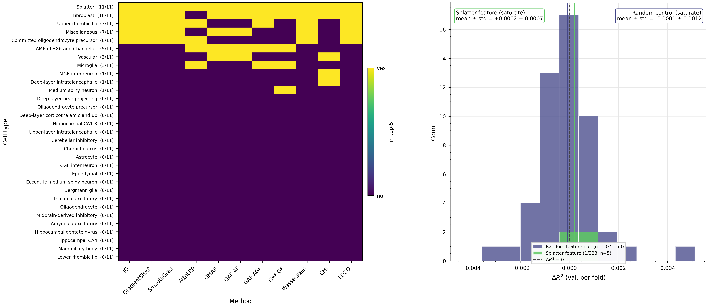

# ResDec-MHE

Hybrid graph-tabular model for predicting cognitive resilience from single-nucleus RNA-seq, with a multi-method interpretability suite.

## Overview

- **Task.** Continuous regression of `cogn_global` from per-subject snRNA-seq features, ROSMAP cohort, N=516.
- **Architecture.** Heterogeneous graph transformer + set transformer + fusion encoder, with a multi-head residual head over a frozen TabPFN-2.6 prediction. Composite output: `ŷ = ŷ_TabPFN + f_residual`.
- **Headline.** 5-fold mean R² = 0.4436 ± 0.0996 (per-fold std, ddof=1). Pooled R² = 0.4493.
- **Permutation null.** N=50 full-pipeline label-shuffle re-trains. z = 9.30, one-sided p = 0.0196 (= 1/51).

Manuscript in preparation.

## Results


Left: 5-fold cross-validation predictions vs actual `cogn_global`, all 516 subjects pooled. Color = per-subject residual. Right: 50 label-shuffled permutation-null R² values (small dots, KDE underlay) vs canonical R² = 0.4436 (large dot). Null mean = -0.32, std = 0.082.

### Baselines

One row per method family. R² is mean ± std across the same 5 folds. Full 22-baseline + 13-ablation table at [`outputs/canonical/interpretability/paper_baseline_table.md`](outputs/canonical/interpretability/paper_baseline_table.md).

| Model                         | R² (5-fold)        |
| ----------------------------- | ------------------ |
| **ResDec-MHE (this repo)**    | **0.4436 ± 0.10**  |
| TabPFN-2.6 standalone         | 0.3994 ± 0.10      |
| XGBoost (best classical)      | 0.3584 ± 0.05      |
| RandomForest                  | 0.3136 ± 0.07      |
| Ridge                         | 0.2697 ± 0.08      |
| Clinical-only linear regression | 0.2100 ± 0.08    |
| MixMIL (Engelmann '24)        | 0.1572 ± 0.08      |
| GPIO                          | 0.1529 ± 0.07      |
| Perceiver-IO                  | 0.1246 ± 0.05      |
| scPhase (Berson '25)          | -0.0742 ± 0.05     |

### Statistical tests

- **Stouffer-combined paired Wilcoxon vs TabPFN-2.6** across 5 seeds {21, 42, 67, 426, 2000}: combined z = 4.02, p = 2.93 × 10⁻⁵. Per-seed: 4/5 at p = 0.0312 (W = 15, 5/5 fold wins); seed 2000 at p = 0.0625 (W = 14, 4/5 wins, fold-0 Δ = -0.002). Source: [`seed_variation_wilcoxon.json`](outputs/canonical/interpretability/seed_variation_wilcoxon.json).
- **vs 22 baselines**: 22/22 pass BH-FDR at α = 0.05 (worst q = 0.014); 20/22 pass Bonferroni at α/22 = 0.00227. Source: [`baseline_fdr_correction.json`](outputs/canonical/interpretability/baseline_fdr_correction.json).
- **vs clinical-only baseline** (age, sex, education, Braak stage, APOE-ε4 dosage): ΔR² = +0.234 per-fold, 5/5 fold wins, paired Wilcoxon p = 0.03125. Source: [`clinical_baseline_summary.json`](outputs/canonical/clinical_baseline/clinical_baseline_summary.json).
- **Cross-seed stability**: 5 seeds yield mean R² = 0.4347 ± 0.0075, vs within-seed cross-fold std ≈ 0.10 — train/val split drives variance, not seed.

> **Caveat on validation.** All numbers are 5-fold cross-validation on N=516 ROSMAP subjects. No held-out 20% test set. External-cohort validation (SEA-AD, MAYO, MSBB) is the next step.

## Architecture

```
Per-subject input:
  ~70k cells × 31 cell types × 4785 highly variable genes
  Across 6 brain regions; per-CT cell counts span 4 orders of magnitude
  Cell-cell communication graph (CellChatDB-derived) per subject

         pseudobulk per (CT, gene)        cell-cell graph
                  │                              │
                  ▼                              ▼
         ┌──────────────────────────────────────────────┐
         │                Encoder                        │
         │  ├─ HGT graph transformer                     │
         │  ├─ Set transformer (cells per type)          │
         │  └─ Fusion → 64-d subject embedding z         │
         └──────────────────────────────────────────────┘
                              │
                              ▼
         ┌──────────────────────┐    ┌──────────────────────┐
         │  ResDec head         │    │ TabPFN-2.6 (frozen)  │
         │  8 parallel heads    │    │ per-CT gene-mean     │
         │  → f_residual        │    │ pseudobulk → ŷ_TabPFN│
         └──────────────────────┘    └──────────────────────┘
                     │                          │
                     └──────────┬───────────────┘
                                ▼
                       ŷ = ŷ_TabPFN + f_residual
```

Components:
- **TabPFN-2.6** (Hollmann et al. 2025): pretrained tabular foundation model, frozen, used as a baseline prediction. Inputs: per-cell-type gene-mean pseudobulk.
- **HGT** (Heterogeneous Graph Transformer): graph attention over the per-subject cell-cell communication graph (CellChatDB ligand-receptor pairs).
- **Set transformer** (Lee et al. 2019, ISAB variant): permutation-invariant pooling over cells within each cell type.
- **Fusion**: concatenate HGT and set-transformer outputs, project to a 64-dim subject embedding `z`.
- **ResDec head**: 8 parallel prediction heads (TabM-style multi-head expansion, k_tabm = 8) over `z`, with a vanilla 4-head multi-head attention block. Output is averaged into `f_residual`.

Ablations:

| Variant                                  | R² (5-fold)       |
| ---------------------------------------- | ----------------- |
| Canonical (this repo)                    | 0.4436 ± 0.10     |
| No TabPFN base (deep encoder only)       | 0.2659 ± 0.04     |
| FiLM with real subject metadata          | 0.4333 ± 0.08     |
| Diff-attention head (Ye et al. 2025)     | 0.4373 ± 0.09     |
| n_stages = 2                             | 0.4305 ± 0.09     |
| n_stages = 3                             | 0.4310 ± 0.09     |

The canonical configuration uses a FiLM layer with a zero metadata vector (effectively a no-op).

Lightning module: [`src/training/resdec_lightning_module.py`](src/training/resdec_lightning_module.py). Training driver: [`scripts/resdec_mhe/training/train.py`](scripts/resdec_mhe/training/train.py). Config: [`configs/resdec_mhe/canonical.yaml`](configs/resdec_mhe/canonical.yaml).

## Task framing


Each dot is one subject. Dashed line: OLS fit `cogn_global ~ gpath`. Color: per-subject residual (green = high cognition given pathology; magenta = low). Spearman ρ = -0.461 across 516 subjects.

- Training target is `cogn_global` (continuous z-scored cognition composite). The model is **not** trained on a pathology-residualized target.
- "Cognitive resilience" is interpreted post-hoc: subjects above the regression line have cognition higher than their pathology alone would predict.
- Cohort: ROSMAP, longitudinal study of brain aging at the Rush Alzheimer's Disease Center, gated via Synapse.

## Interpretability

Eleven methods grouped into three families. Outputs at [`outputs/canonical/interpretability/`](outputs/canonical/interpretability/).

| Family                                      | Methods                                                      |
| ------------------------------------------- | ------------------------------------------------------------ |
| Gradient-attribution (Captum)               | Integrated Gradients, GradientSHAP, SmoothGrad               |
| Attention-based                             | AttnLRP, GMAR, GAF AF / AGF / GF                             |
| Distributional / information / perturbation | Wasserstein-1, Conditional MI, LOCO zero-out                 |

<details>
<summary>Per-method one-line tooltips</summary>

| Method | Family | What it computes |
|---|---|---|
| Integrated Gradients (IG) | gradient | path integral of `∂output/∂input` from a baseline to the input |
| GradientSHAP | gradient | Shapley-value gradient attribution averaged over baselines |
| SmoothGrad | gradient | Gaussian-noise-averaged input gradient |
| AttnLRP | attention | layer-wise relevance propagation through attention layers |
| GMAR | attention | generic multi-head attention rollout |
| GAF AF / AGF / GF | attention | three variants of generic attention flow (Chefer et al. 2021) |
| Wasserstein-1 | distributional | per-(CT, gene) earth-mover distance, resilient n=129 vs vulnerable n=129 |
| Conditional MI | information | per-CT mutual information between pseudobulk and target, on raw N=516 |
| LOCO zero-out | perturbation | each CT's pseudobulk replaced with zero; measure ΔR² (5-fold inference) |

</details>

### Cross-method consensus and SAE causal patching



Left: per-CT top-5 membership across 11 methods. Two CTs are top-5 in nearly every method: Splatter (a Siletti et al. 2023 reference cell type, identified in our cohort by SST+CHODL+NPY+NOS1 markers; top-5 in 11/11) and Fibroblast (top-5 in 10/11; missing AttnLRP).

Right: SAE causal patching. Sparse autoencoders trained on the canonical encoder's pooled fused-layer activations produce 323 features that pass a relaxed-interpretability filter (non-dead, `mw_p_cognition < 0.05`, `fraction_active ∈ [10⁻⁴, 0.5]`, `ct_dominance ≤ 0.7`). Of those 323, exactly 1 has a decoder weight that concentrates on Splatter (Splatter has the lowest per-CT count among all 31 CTs — vs 28 for Microglia, 23 for OPC, 22 for Deep-layer IT). Saturate-mode patch on that feature: ΔR² = +0.000213 ± 0.000666 (5 folds). Random-feature null (10 features × 5 folds): ΔR² = -0.0000728 ± 0.001190. Distributions overlap.

Source: [`outputs/canonical/sae/feature_xref_consensus.json`](outputs/canonical/sae/feature_xref_consensus.json), [`outputs/canonical/interpretability/sae_causal_patching.json`](outputs/canonical/interpretability/sae_causal_patching.json).


Top: set-overlap of method top-5 cell-type rankings, 11 methods. Right-most bar (height 2) is the 11/11 intersection: Splatter and Fibroblast.

Bottom: set-overlap of top-50 (CT, gene) pair rankings, restricted to 6 gene-rankable methods (Captum IG, GradientSHAP, SmoothGrad, DE Wilcoxon, DE DESeq2, Wasserstein-1). Within-attribution-family overlaps reach 48/50; cross-family agreement drops to 0–8. 0 pairs in 6/6; 31 of 2332 union genes (collapsing the CT axis) appear in 6/6. Median pairwise Jaccard on (CT, gene) pairs = 0.0; on genes only = 0.16.

Source: [`outputs/canonical/interpretability/cross_method_gene_jaccard.json`](outputs/canonical/interpretability/cross_method_gene_jaccard.json).

## Reproducibility

ROSMAP cohort data is gated. Place the inputs at:
- `data/snRNAseq/adata_ROSMAP_preprocessed.h5ad` (≈70 GB; 516 subjects × 31 CTs × 4785 HVGs)
- `data/precomputed/precomputed_dataset.pt` (per-subject pseudobulk + cell metadata cache)
- `data/canonical/tabpfn_outer_fold{0..4}.npz`, `tabpfn_oof_fold{0..4}.npz` (per-fold TabPFN caches)
- `outputs/splits.json` (canonical 5-fold split assignments)
- `data/metadata_ROSMAP/metadata.csv` (clinical metadata)

Tests:
```bash
uv run pytest tests/unit/         # per-module
uv run pytest tests/integration/  # end-to-end
uv run pytest tests/              # full suite, ~6 min
```

End-to-end pipeline:

```bash
# 1. Build TabPFN caches
uv run python scripts/resdec_mhe/tabpfn/compute_top_k_features.py
uv run python scripts/resdec_mhe/tabpfn/compute_oof.py
uv run python scripts/resdec_mhe/tabpfn/compute_outer.py

# 2. Train ResDec-MHE 5-fold (parallel across 2 GPUs)
CONFIG=configs/resdec_mhe/canonical.yaml \
OUTROOT=outputs/canonical/p5_canonical_seed42 \
SEED=42 \
bash scripts/resdec_mhe/training/run_5fold_parallel.sh

# 3. Aggregate the paper baseline table
uv run python scripts/resdec_mhe/interpretability/make_baseline_table.py

# 4. Headline interpretability suite
uv run python scripts/resdec_mhe/interpretability/captum_composite_attribution.py
uv run python scripts/resdec_mhe/interpretability/run_distributional_resilience.py
uv run python scripts/resdec_mhe/interpretability/run_loco_zero_out.py
uv run python scripts/resdec_mhe/interpretability/run_resilience_analyses.py --aggregation raw_max

# 5. SAE distributed-representation suite
uv run python scripts/resdec_mhe/interpretability/extract_sae_activations.py
CUDA_VISIBLE_DEVICES=0 GPU_INDEX=0 NUM_GPUS=2 bash scripts/resdec_mhe/run_sae_sweep.sh &
CUDA_VISIBLE_DEVICES=1 GPU_INDEX=1 NUM_GPUS=2 bash scripts/resdec_mhe/run_sae_sweep.sh &
wait
uv run python scripts/resdec_mhe/interpretability/run_sae_causal_patching.py

# 6. Permutation null (N=50, full-pipeline; ~16 hr in tmux)
tmux new -d -s permnull_n50 'bash scripts/resdec_mhe/_launch_permnull_n50_perm_shard.sh'
uv run python scripts/resdec_mhe/training/aggregate_permnull_n50_shards.py

# Render the README's figures
uv run python scripts/resdec_mhe/interpretability/make_readme_fig1_problem.py
uv run python scripts/resdec_mhe/interpretability/make_readme_fig2_result.py
uv run python scripts/resdec_mhe/interpretability/make_readme_fig3_consensus_causal.py
uv run python scripts/resdec_mhe/interpretability/make_readme_fig4_upset.py
```

## Repository structure

```
proj_ml_snrna/
├── src/                          # production source (importable as src.*)
│   ├── analysis/                 # post-hoc analyses, attribution, SAE, CMI, counterfactuals
│   ├── data/                     # datasets, datamodule, collate, splits, AnnData loader
│   ├── models/                   # encoder + heads (full_model.py, resdec_head/)
│   ├── training/                 # Lightning module, callbacks, optimizers
│   └── visualization/            # figure-drawing primitives + theme.py
├── scripts/resdec_mhe/           # CLI entrypoints (training/, interpretability/, tabpfn/)
├── configs/                      # OmegaConf YAMLs (default.yaml + resdec_mhe/canonical.yaml)
├── tests/                        # pytest tree (unit, integration, regression, smoke, negative)
├── baselines/                    # vendored or adapted external baselines
├── figures/                      # README figures
├── data/                         # raw + precomputed inputs (gitignored)
└── outputs/                      # training + interpretability outputs (gitignored)
```

## Citation

```
Hong, J.H. (2026). ResDec-MHE: Hybrid Graph-Tabular Model for Cognitive
Resilience Prediction with Multi-Method Interpretability. GitHub:
https://github.com/Joon-Hwan-Hong/multi-scale-hybrid-hgt
```

## License

GPL-3.0. See [LICENSE](LICENSE).

## Acknowledgments

PyTorch, PyTorch Lightning, Pyro, OmegaConf, scanpy, anndata, statsmodels, Captum. Baselines: TabPFN-2.6 (Hollmann et al. 2025), XGBoost, MixMIL (Engelmann et al. 2024), scPhase (Berson et al. 2025), GPIO, CloudPred, Perceiver-IO. SAE methodology: Cunningham et al. 2024, Bussmann 2024, Gao 2024, Paulo & Belrose 2025, Heap et al. 2026. ROSMAP cohort: Religious Orders Study and Memory and Aging Project, Rush Alzheimer's Disease Center.
