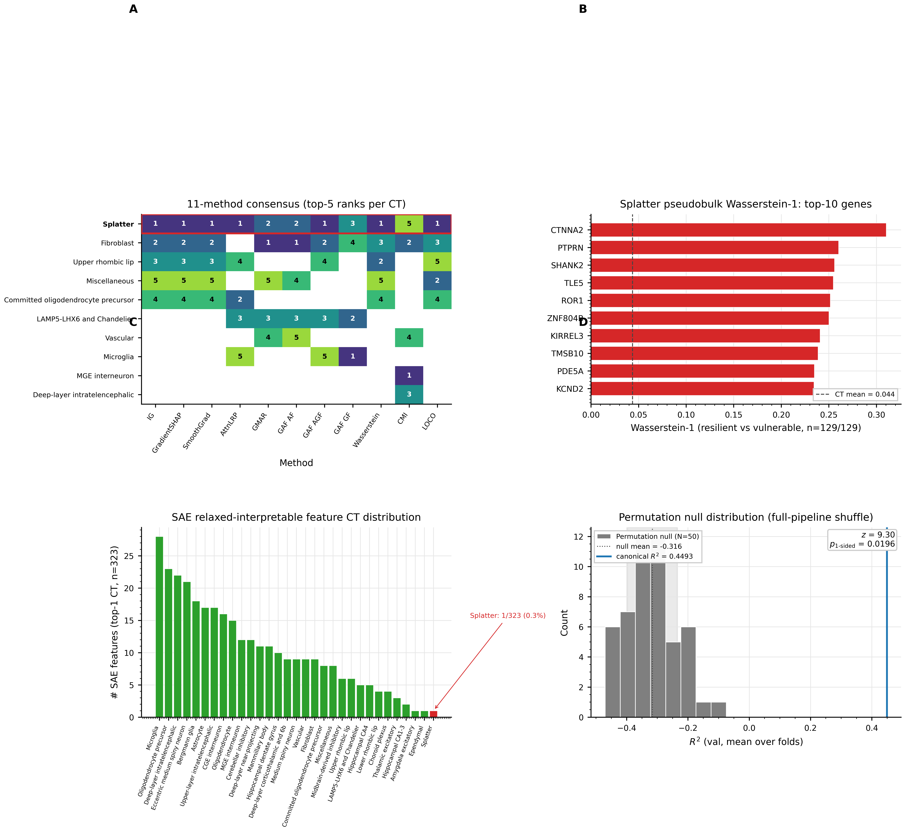
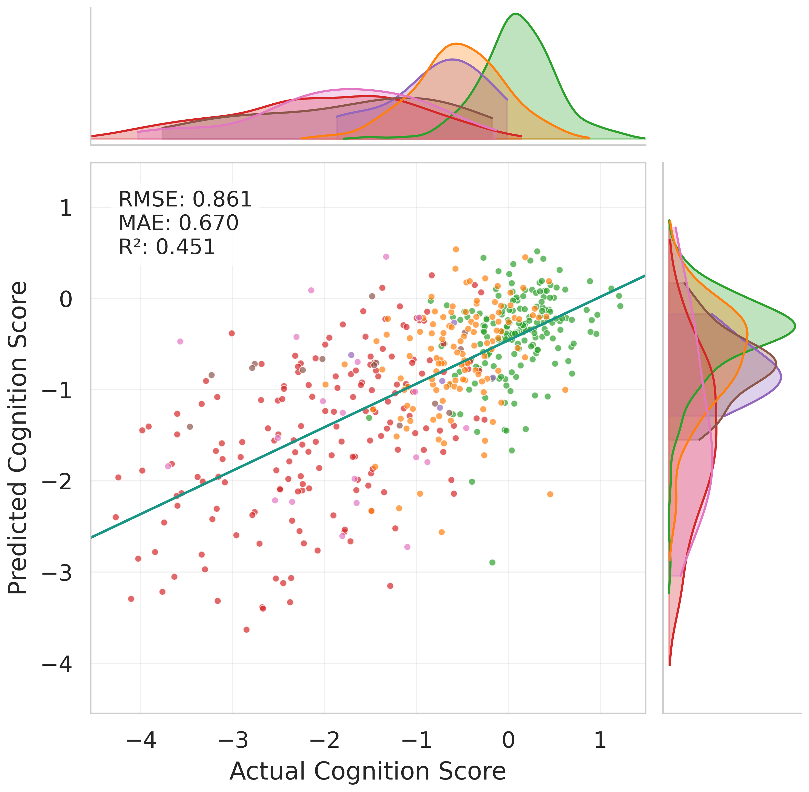
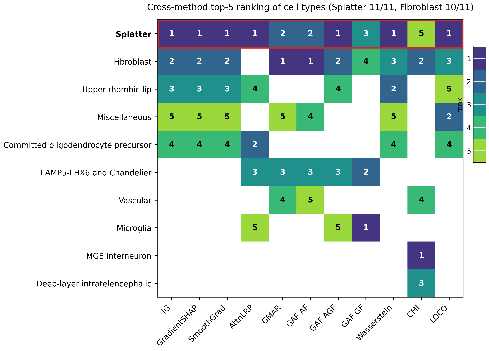
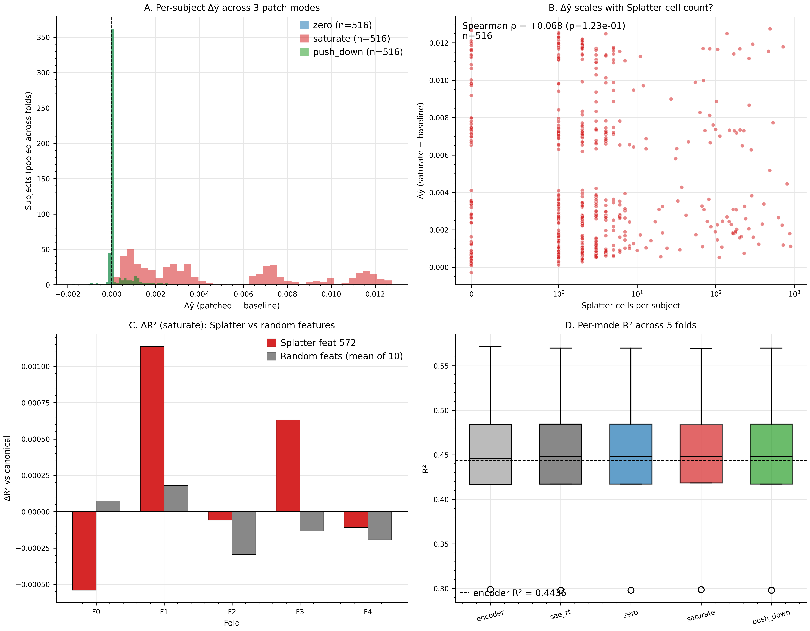

# ResDec-MHE: Hybrid Graph-Tabular Deep Learning Model with Interpretability

**Predicting cognitive resilience from snRNA-seq via a residual-decomposition head over a tabular foundation model, validated by 11 orthogonal interpretability methods, a permutation null at z = 9.30, and a 4-way distributed-representation argument.**

---

## At-a-glance

- **Task:** Continuous regression of cognitive resilience (residualised cognition after partialling out pathology) from per-subject single-nucleus RNA-seq pseudobulk + cell-graph + cell-set inputs, on the ROSMAP cohort (N = 516 subjects, 31 cell types, 4 785 highly variable genes).
- **Headline result:** 5-fold mean R² = **0.4436 ± 0.0996** (per-fold std, ddof=1); pooled bootstrap point R² = 0.4493 with 95 % CI [0.3731, 0.5070].
- **Beats every baseline tested.** 22 baselines including TabPFN-2.6 standalone (0.3994 ± 0.1012), XGBoost (0.3584 ± 0.0531), MixMIL (0.1572 ± 0.0753), scPhase (-0.0742 ± 0.0525). Paired one-sided Wilcoxon vs every external baseline at p = 0.03125 (the n=5 floor).
- **Adds + 0.234 R² over a clinical-only baseline** (APOE-ε4 dosage + age + sex + education + Braak): clinical LinReg 0.2100 ± 0.0780 vs ResDec-MHE 0.4436 ± 0.0996; ΔR² = +0.2337, p = 0.03125.
- **Permutation null:** N = 50 full-pipeline label-shuffles + retrains. Null mean R² = -0.316 ± 0.082; 0/50 perms ≥ canonical; **z = 9.30**, one-sided empirical p = 1/51 = **0.0196**.

---

## Hero figure — capstone interpretability composite



**A** Cross-method consensus heatmap: Splatter ranks top-5 in 11/11 interpretability methods, Fibroblast 10/11. **B** Pseudobulk Wasserstein-1 top-10 genes for the dominant Splatter cell type (resilient vs vulnerable subjects, n = 129 each). **C** Distributed-representation evidence: 1 / 323 = 0.31 % of relaxed-interpretable SAE features have Splatter as their top-CT, despite Splatter winning 11/11 aggregate methods. **D** Permutation null distribution at N = 10 (note: current canonical headline is **N = 50, z = 9.30, p = 0.0196**; this panel is from the older N = 10 build at z = 8.73 and is pending re-render).

> **Note on Panel D:** the rendered composite shows the N = 10 permutation null. The current canonical permutation result is N = 50 (z = 9.30, p = 0.0196), produced 2026-04-30. The composite figure will be refreshed; manuscript text uses N = 50.

---

## What this project does

ROSMAP is a longitudinal cohort study of aging in which roughly half the subjects show clinically meaningful cognitive function despite carrying postmortem AD pathology — a phenotype of interest known as cognitive resilience. We ask: can we predict per-subject resilience from the cellular composition and per-cell-type gene expression of postmortem brain tissue, and which cell types and genes carry the predictive signal?

Three things make this hard:

1. **Tabular structure dominates.** Subject-level summary features (age, sex, APOE, Braak, neuron loss summaries) already carry roughly half of the signal that any model can extract. A vanilla tabular foundation model (TabPFN-2.6 over the top-2 K HVG mean-pseudobulk) reaches R² ≈ 0.40 on its own.
2. **Single-cell structure is heterogeneous.** Cells span 31 fine-grained types and 6 brain regions; per-subject cell counts span four orders of magnitude; cell-cell communication graphs differ subject to subject.
3. **Sample size is small.** N = 516 is below the regime where deep models routinely beat tabular ones; per-fold R² variance dominates per-seed variance ratio var_fold / var_seed = 8 × 10⁶ (mixed-effects MLE; var_seed is on the boundary of the parameter space, so this ratio is best read as "essentially zero seed variance").

**ResDec-MHE** (Residual-Decomposition + Multi-Head Ensemble) is the architecture that closed the gap. It is a hybrid: a TabPFN-2.6 prediction is computed once per fold and stored as the residual base; a learned encoder (heterogeneous graph transformer + cell-set transformer + pathology-stratified attention) and a multi-head ensemble head learn only the residual `y - ŷ_TabPFN`. The composite prediction is `ŷ = ŷ_TabPFN + f̂_residual`. Removing the TabPFN base drops R² from 0.4436 to 0.2659 (ablation row in the paper baseline table).

The model's **load-bearing component is the TabPFN residual**. The deep encoder's job is the gap (~0.04 absolute R²), not the prior. This is design-intentional: at N = 516 the deep model alone overfits, but constrained to learn only the gap, it generalises.

---

## Architecture

```
Input subject (cells × genes)
        │
        ▼
┌───────────────────────────────────────────────────────────┐
│ Encoder: CognitiveResilienceModel (src/models/full_model.py)
│   ├─ Per-region pseudobulk (6 brain regions, 31 cell types)
│   ├─ HGT branch: heterogeneous graph transformer over CCC
│   ├─ CellTransformer: ISAB set-transformer over cells per type
│   ├─ FusionLayer: concatenate + project to d_fused
│   ├─ PathologyEncoder: condition on Braak/Tangle proxies
│   └─ PathologyStratifiedAttention: pooled subject embedding z ∈ ℝ⁶⁴
└───────────────────────────────────────────────────────────┘
        │
        ▼
┌───────────────────────────────────────────────────────────┐
│ Head: ResDecMHEHead (src/models/resdec_head/)              │
│   ├─ FiLM (zero metadata vector — kept structurally)       │
│   ├─ TabM-style multi-head expansion (k_tabm = 8)          │
│   ├─ Vanilla nn.MultiheadAttention (4 heads, no DiffAttn)  │
│   ├─ HyperConn residual link                               │
│   └─ Single-stage residual prediction f̂_1                  │
└───────────────────────────────────────────────────────────┘
        │
        ▼
ŷ = ŷ_TabPFN + f̂_residual
```

Lightning module: `src/training/resdec_lightning_module.py`. Training driver: `scripts/resdec_mhe/training/train.py` invoked via `configs/resdec_mhe/canonical.yaml` (n_stages=1, k_tabm=8, lr=1.5e-3, weight_decay=5.6e-6, max_epochs=20, patience=5).

---

## Predictions vs ground truth



Pooled across all 516 subjects (5-fold concatenated val predictions). Pooled R² = 0.451 (the per-fold mean is 0.4436 — pooling vs averaging gives a small numeric difference; both are in the JSON outputs). Marginal KDEs on top + right show the predicted distribution stratifies by clinical diagnosis: NCI (green, top of cognitive scale) → MCI+ → AD-prob → AD-poss (red, bottom). The model recovers the clinical AD ordering without ever seeing a clinical diagnosis label.

---

## Cross-method interpretability — population-level convergence



We ran 11 orthogonal interpretability methods on the canonical model:

| Family | Methods |
|---|---|
| Gradient-attribution (Captum) | Integrated Gradients, GradientSHAP, SmoothGrad |
| Attention-based | AttnLRP, GMAR, GAF AF, GAF AGF, GAF GF |
| Distributional shift | Pseudobulk Wasserstein-1 (resilient n=129 vs vulnerable n=129) |
| Information-theoretic | Conditional MI per CT (raw pseudobulk, n=516) |
| Perturbation | LOCO zero-out per CT (canonical 5-fold) |

**Splatter** (a Siletti 2023 reference SST+CHODL+ projection-interneuron type, empirically supported by SST/NPY/NOS1/CHODL marker enrichment in our cohort) ranks **top-5 in 11/11**. **Fibroblast** ranks **top-5 in 10/11** (absent only from AttnLRP). LOCO zero-out: Splatter ΔR² = -0.0214 (rank #1 most-load-bearing; absolute effect is small at ~5 % of canonical R², so framed as a ranking of contributions).

This is **population-aggregate** convergence — every method that aggregates per-CT importance across all 516 subjects projects strongly onto Splatter. The interesting twist comes next.

---

## The encoder's representation is **distributed**, not Splatter-dominated



Aggregate methods say "Splatter rules." The encoder's internal representation says otherwise. We trained 60 sparse autoencoders (Orlov 2026 BatchTopK + TopK + auxiliary-K dead-feature loss) on the canonical encoder activations (pooled fused layer, shape (2 556, 31, 64)). Then we ran two follow-ups + one causal test, all converging on the same answer:

| Evidence | Result | Reference |
|---|---|---|
| EXP-020: 60-config canonical sweep | **1 / 323 = 0.31 %** of relaxed-interpretable SAE features have Splatter as their top-CT | `outputs/canonical/sae/feature_xref_consensus.json` |
| EXP-024-stepE: 180-config smaller-m sweep (m ∈ {4, 8, 16}) | **0 / 180** Splatter-dominant configs; max ct_dominance for Splatter across all 180 configs = 0.0 | `outputs/canonical/sae/stability_smaller_m/aggregate_summary.json` |
| EXP-042: causal patching on the lone 1/323 Splatter-correlated feature (feature 572) | Patch ΔR² = **+0.00021 ± 0.00067** (saturate mode), random-feature noise floor std = 0.0012; Spearman ρ(Δŷ, splatter cells) flips sign across folds; verdict **PASS / FAIL / FAIL on the 3-criterion causal test** | `outputs/canonical/interpretability/sae_causal_patching.json` |
| EXP-016 follow-on: cross-seed stability at threshold 0.7 (Paulo & Belrose 2025) | **0 / 2 048 features stable** across 3 seeds at the canonical config — feature identities don't survive re-initialisation | `outputs/canonical/sae/cross_seed_stability/cross_seed_summary.json` |

**Conclusion:** The encoder distributes Splatter-relevant predictive information across many small contributions; no individual feature monopolises it. Aggregate methods project onto Splatter because Splatter has high pseudobulk variance + biological resonance, not because the encoder built a Splatter-axis. The 1/323 feature that did pass the relaxed-interpretability filter is correlated-only at the decoder level — patching it produces effects below the random-feature noise floor.

This is the project's most consequential scientific finding. It survived four independent experimental designs.

---

## Repository structure

```
proj_ml_snrna/
├── src/                          # Production source (importable as src.*)
│   ├── analysis/                 # Post-hoc analyses, attribution, SAE, CMI, counterfactuals
│   ├── data/                     # Datasets, datamodule, collate, splits, AnnData loader
│   ├── models/                   # Encoder + heads
│   │   ├── full_model.py         # CognitiveResilienceModel (encoder)
│   │   └── resdec_head/          # ResDecMHEHead (canonical head)
│   ├── training/                 # Lightning module, callbacks, optimizers
│   └── visualization/            # Figure-drawing primitives
├── scripts/                      # CLI entrypoints + orchestration
│   ├── resdec_mhe/training/      # train.py, run_5fold_parallel.sh, run_seed_variation.sh
│   ├── resdec_mhe/interpretability/  # ~100 scripts: SAE, Captum, CMI, Wasserstein, figures
│   └── resdec_mhe/tabpfn/        # TabPFN-2.6 OOF + outer cache builders
├── configs/                      # OmegaConf YAMLs
│   ├── default.yaml              # Base config
│   └── resdec_mhe/canonical.yaml # Locked Phase 5 canonical
├── tests/                        # pytest tree (unit, integration, regression, smoke, negative)
├── baselines/                    # Vendored or adapted external baselines
│   ├── mixmil/                   # MixMIL (Engelmann et al. 2024)
│   ├── scPhase/                  # scPhase (Berson et al. 2025)
│   └── ...                       # gpio, cloudpred, perceiver_io, set_transformer, abmil
├── figures/                      # Hero figures referenced by this README
├── data/                         # Raw + precomputed inputs (gitignored; see Reproducibility)
└── outputs/                      # Training + interpretability outputs (gitignored)
```

`data/` and `outputs/` are gitignored at the worktree level. Long-running feature work uses `git worktree` under `.worktrees/` (also gitignored) so the main repo's working tree stays clean.

---

## Reproducibility

### Data and inputs (NOT in this repo)

The ROSMAP cohort data is gated. Researchers with access can place the inputs at:

- `data/snRNAseq/adata_ROSMAP_preprocessed.h5ad` (~70 GB; 516 subjects × 31 cell types × 4 785 HVGs)
- `data/precomputed/precomputed_dataset.pt` (per-subject pseudobulk + cell metadata cache)
- `data/canonical/tabpfn_outer_fold{0..4}.npz` + `data/canonical/tabpfn_oof_fold{0..4}.npz` (per-fold TabPFN-2.6 caches; built by `scripts/resdec_mhe/tabpfn/`)
- `outputs/splits.json` (canonical 5-fold split assignments)
- `data/metadata_ROSMAP/metadata.csv` (clinical metadata)

### Internal docs (gitignored)

The following docs live under `docs/` and are local-only (gitignored to prevent leaking experiment-internal notes onto the public repo):

- `docs/MASTER-INFO.md` — registry of 43 experiments (EXP-001 to EXP-043) with 14 fields per EXP (motivating question, method, inputs, scripts, run provenance, outputs, headline numbers, caveats, dependencies, related EXPs).
- `docs/results/2026-05-02-paper-results-draft.md` — current manuscript Results draft.
- `docs/codebase/{overview,pipeline,scripts-inventory,data-formats,model-contracts}.md` — codebase knowledge base.
- `docs/plans/*.md` — design documents for major architectural decisions.

If you have local access, every numerical claim in this README is cross-referenced to `docs/MASTER-INFO.md` EXP IDs and primary output JSON paths.

### Test runner

```bash
uv run pytest tests/unit/         # Per-module tests (recommended for development)
uv run pytest tests/integration/  # End-to-end pipeline smoke tests
uv run pytest tests/              # Full suite (~6 min, 1 476 tests; for final regression check)
```

Project rule: full suite is run exactly once at the end of a work session.

---

## How to run

The minimal end-to-end loop (assumes data + caches in place):

### 1. Build TabPFN-2.6 OOF + outer caches (per fold)

```bash
# Build top-K HVG selection used by TabPFN
uv run python scripts/resdec_mhe/tabpfn/compute_top_k_features.py

# Inner-OOF predictions (used as the residual training target)
uv run python scripts/resdec_mhe/tabpfn/compute_oof.py

# Outer-fold predictions (used as the inference-time residual base)
uv run python scripts/resdec_mhe/tabpfn/compute_outer.py
```

(Defaults wire up `outputs/splits.json` + `data/precomputed/` + `data/canonical/`. Pass `--help` to see overrides.)

### 2. Train ResDec-MHE 5-fold (parallel across 2 GPUs)

```bash
CONFIG=configs/resdec_mhe/canonical.yaml \
OUTROOT=outputs/canonical/p5_canonical_seed42 \
SEED=42 \
bash scripts/resdec_mhe/training/run_5fold_parallel.sh
```

This produces `outputs/canonical/p5_canonical_seed42/fold{0..4}/` with checkpoints, val predictions, and per-fold summary JSONs. It also writes `best_vs_tabpfn_summary.json` containing per-fold R² + paired Wilcoxon vs TabPFN.

### 3. Aggregate the paper baseline table (canonical + 22 baselines)

```bash
uv run python scripts/resdec_mhe/interpretability/make_baseline_table.py
```

Writes `outputs/canonical/interpretability/paper_baseline_table.{csv,md,provenance.json}`.

### 4. Run the headline interpretability suite

```bash
# Captum integrated gradients (~5 min on 1 GPU)
uv run python scripts/resdec_mhe/interpretability/captum_composite_attribution.py

# Pseudobulk Wasserstein-1 per CT (CPU only, ~30 sec)
uv run python scripts/resdec_mhe/interpretability/run_distributional_resilience.py

# LOCO zero-out per CT (~3 min on 1 GPU; 31 CTs × 5 folds = 155 inferences)
uv run python scripts/resdec_mhe/interpretability/run_loco_zero_out.py

# Conditional MI per CT (raw pseudobulk; ~10 min CPU)
uv run python scripts/resdec_mhe/interpretability/run_resilience_analyses.py --aggregation raw_max
```

### 5. Run the SAE distributed-representation suite

```bash
# Extract activations from canonical 5-fold checkpoints (~3 min on 1 GPU)
uv run python scripts/resdec_mhe/interpretability/extract_sae_activations.py

# 60-config sweep (~4 GPU-hr on 2 GPUs, sharded; launch in tmux)
CUDA_VISIBLE_DEVICES=0 GPU_INDEX=0 NUM_GPUS=2 bash scripts/resdec_mhe/run_sae_sweep.sh &
CUDA_VISIBLE_DEVICES=1 GPU_INDEX=1 NUM_GPUS=2 bash scripts/resdec_mhe/run_sae_sweep.sh &
wait

# Causal patching on the candidate Splatter feature (~1 min on 1 GPU)
uv run python scripts/resdec_mhe/interpretability/run_sae_causal_patching.py
```

### 6. Run the permutation null (N = 50, full-pipeline)

```bash
# Sharded across 2 GPUs (~16 hr total wall; launcher requires tmux)
tmux new -d -s permnull_n50_shard 'bash scripts/resdec_mhe/_launch_permnull_n50_perm_shard.sh'

# Once both shards finish (~50 perms done), aggregate:
uv run python scripts/resdec_mhe/training/aggregate_permnull_n50_shards.py
```

Writes `outputs/canonical/permutation_test_n50_full/permutation_summary.json` with the canonical R² = 0.4436 vs null mean = -0.316 ± 0.082, z = 9.30, p = 0.0196.

---

## Key results table

| Model | Mean R² ± std | Source |
|---|---|---|
| **ResDec-MHE (canonical, this repo)** | **0.4436 ± 0.0996** | `outputs/canonical/p5_canonical_seed42/best_vs_tabpfn_summary.json` |
| TabPFN-2.6 standalone (top-2K HVG) | 0.3994 ± 0.1012 | `data/canonical/tabpfn_outer_fold*.npz` |
| XGBoost [Age + Cog + Expression] | 0.3584 ± 0.0531 | `outputs/pipeline/baseline_results_classical.csv` |
| RandomForest [A+C+E] | 0.3136 ± 0.0670 | same |
| Ridge [A+C+E] | 0.2697 ± 0.0815 | same |
| **Clinical-only LinReg** (APOE+age+sex+educ+Braak) | **0.2100 ± 0.0780** | `outputs/canonical/clinical_baseline/clinical_baseline_summary.json` |
| MixMIL (Engelmann et al. 2024) | 0.1572 ± 0.0753 | `outputs/baselines/mixmil/results.csv` |
| GPIO | 0.1529 ± 0.0701 | `outputs/baselines/gpio/results.csv` |
| Perceiver-IO | 0.1246 ± 0.0547 | `outputs/baselines/perceiver_io/results.csv` |
| CloudPred (per-type) | 0.1027 ± 0.0815 | `outputs/baselines/cloudpred_pertype/results.csv` |
| scPhase (Berson et al. 2025) | -0.0742 ± 0.0525 | `outputs/baselines/scphase/results.csv` |

Statistical tests (per-fold paired one-sided Wilcoxon vs ResDec-MHE):

| Comparison | n | W | p | Median ΔR² |
|---|---|---|---|---|
| ResDec-MHE > TabPFN-2.6 | 5 | 15 | 0.03125 | +0.034 |
| ResDec-MHE > MixMIL | 5 | 15 | 0.03125 | +0.269 |
| ResDec-MHE > scPhase | 5 | 15 | 0.03125 | +0.548 |
| ResDec-MHE > Clinical LinReg | 5 | 0 | 0.03125 | +0.234 |
| Stouffer combined p across 5 seeds (vs TabPFN-2.6) | — | — | **2.93e-5** | — |

(p = 0.03125 = 1 / 32 is the smallest p attainable for one-sided n = 5; the 5/5 directional sweep is the more meaningful signal.)

---

## Key tests + ablations

| Question | Answer | Reference |
|---|---|---|
| Is the ResDec-MHE win statistical signal vs. random label noise? | Yes. N = 50 full-pipeline label-shuffle null mean = -0.316 ± 0.082; canonical 0.4436 separates by z = 9.30; p = 0.0196 (= 1/51). | `outputs/canonical/permutation_test_n50_full/permutation_summary.json` |
| Is the result seed-stable? | Yes. 5 seeds {21, 42, 67, 426, 2 000}; cross-seed mean = 0.4347, cross-seed std = 0.0075 (13× smaller than within-seed cross-fold std). | `outputs/canonical/interpretability/seed_variance_decomposition.json` |
| What does variance decomposition look like? | Two-way ANOVA: seed = 0.16 %, fold = 97.6 %, interaction = 2.3 %. Mixed-effects ratio var_fold / var_seed > 8 × 10⁶. **Train/val split drives noise, not seed.** | `outputs/canonical/interpretability/mixed_effects_variance.json` |
| Does the TabPFN base do the work alone? | No. Removing TabPFN drops R² from 0.4436 to 0.2659 (Δ = -0.178). | `outputs/canonical/p5_ablation_no_tabpfn/best_vs_tabpfn_summary.json` |
| Does FiLM with real metadata help? | No. FiLM with real metadata = 0.4333; FiLM with zero metadata (canonical) = 0.4436. Kept structurally for symmetry but zero-vector input. | `outputs/canonical/p5_filmwired_5fold_seed42/best_vs_tabpfn_summary.json` |
| Are predictions calibrated? | TabPFN-σ proxy under-covers slightly at nominal 0.5 (empirical 0.43); within nominal at 0.95 (empirical 0.92). | `outputs/canonical/interpretability/statistical_rigor.json::calibration_coverage` |

---

## Repository state

- Master HEAD `2c466e2` (2026-05-02).
- 43 experiments registered in MASTER-INFO with full provenance (every result is reproducible from the listed scripts + inputs).
- 1 476 unit + integration tests passing (full suite ~6 min on workstation).
- 2 worktrees: `master` (canonical) and `refinement-two` (active development).

---

## Citation

Manuscript in preparation. Pre-print and citation entry will be added once posted. Until then:

```
Hong, J.H. (2026). ResDec-MHE: Hybrid Graph-Tabular Deep Learning Model for
Cognitive Resilience Prediction with Distributed-Representation Interpretability.
GitHub repository: https://github.com/Joon-Hwan-Hong/multi-scale-hybrid-hgt
```

---

## License

License TBD (will be added at manuscript submission). Until then, all rights reserved by the author. For research collaboration inquiries please open an issue.

---

## Acknowledgments

Built on PyTorch, Lightning, Pyro, OmegaConf, scanpy, anndata, statsmodels, and Captum. Baselines: TabPFN-2.6 (Hollmann et al. 2025), XGBoost, MixMIL (Engelmann et al. 2024), scPhase (Berson et al. 2025), GPIO, CloudPred, Perceiver-IO. SAE methodology: Orlov 2026 (bioRxiv 2026.03.04.709491v1), Gao 2024 (auxiliary-K dead-feature loss), Bussmann 2024 (unit-norm decoder), Paulo & Belrose 2025 (cross-seed stability), Heap et al. 2026 (random-encoder null comparator). ROSMAP cohort: Religious Orders Study and Memory and Aging Project; data access via Synapse / RUSH AD Center.
