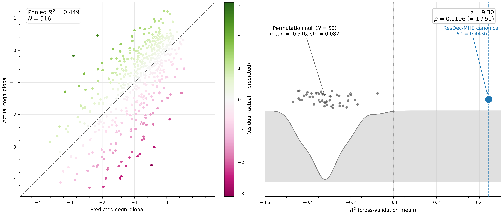
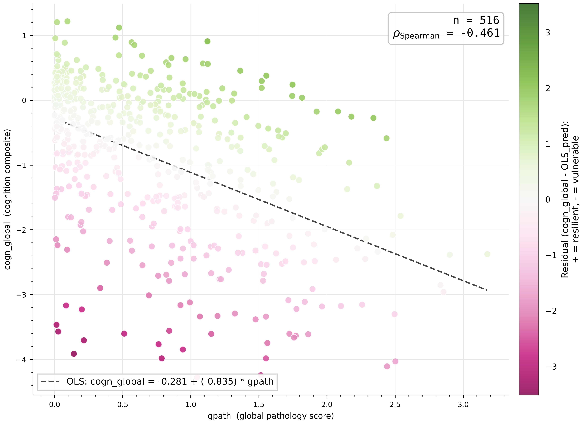
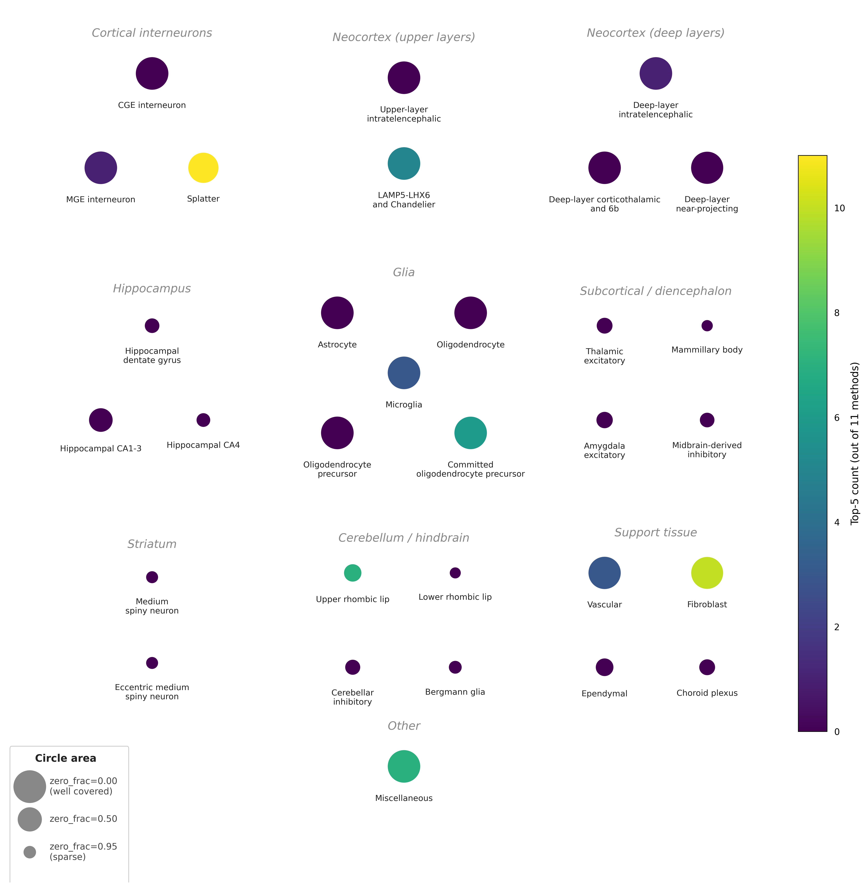
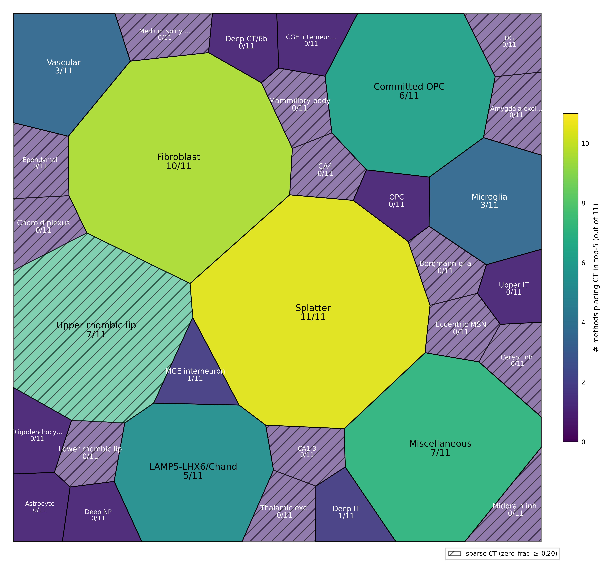
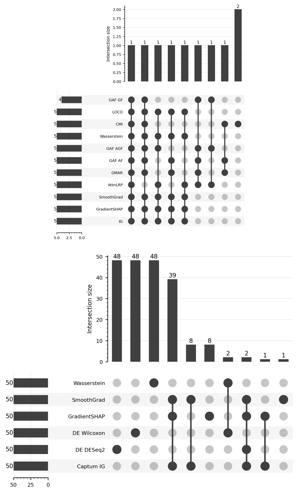
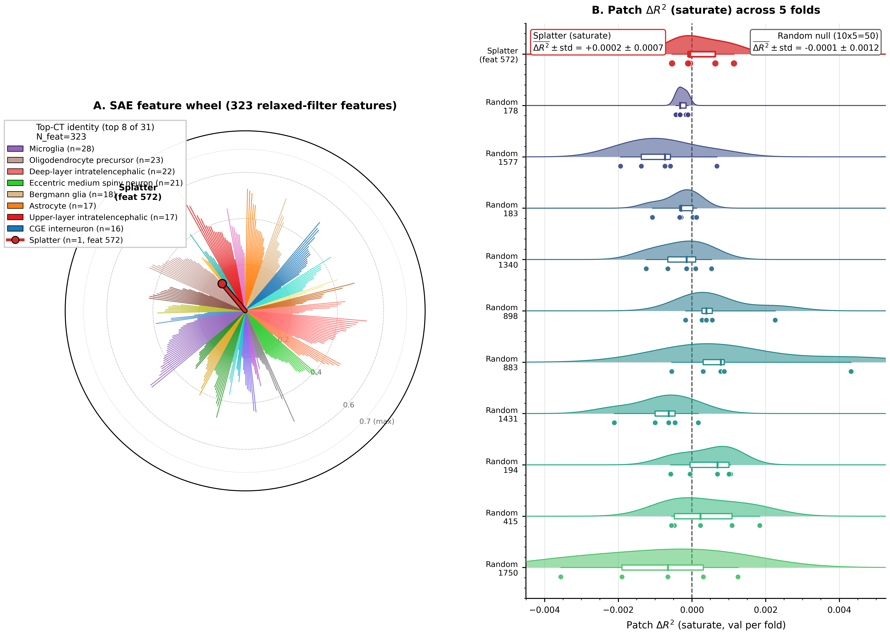
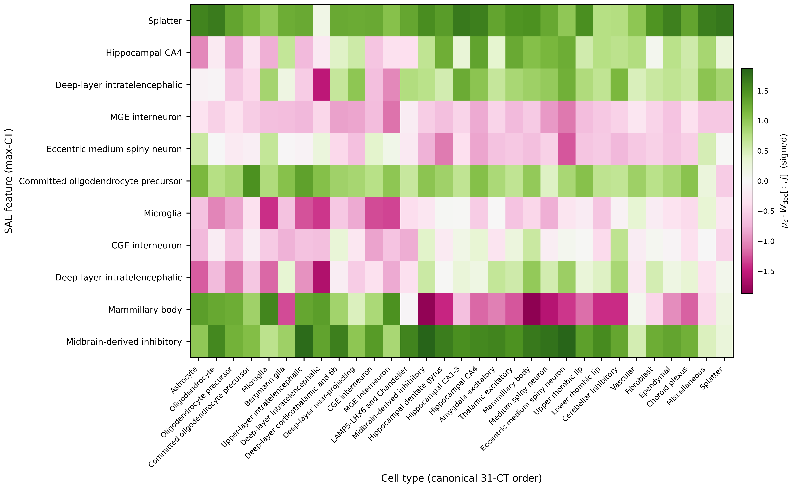
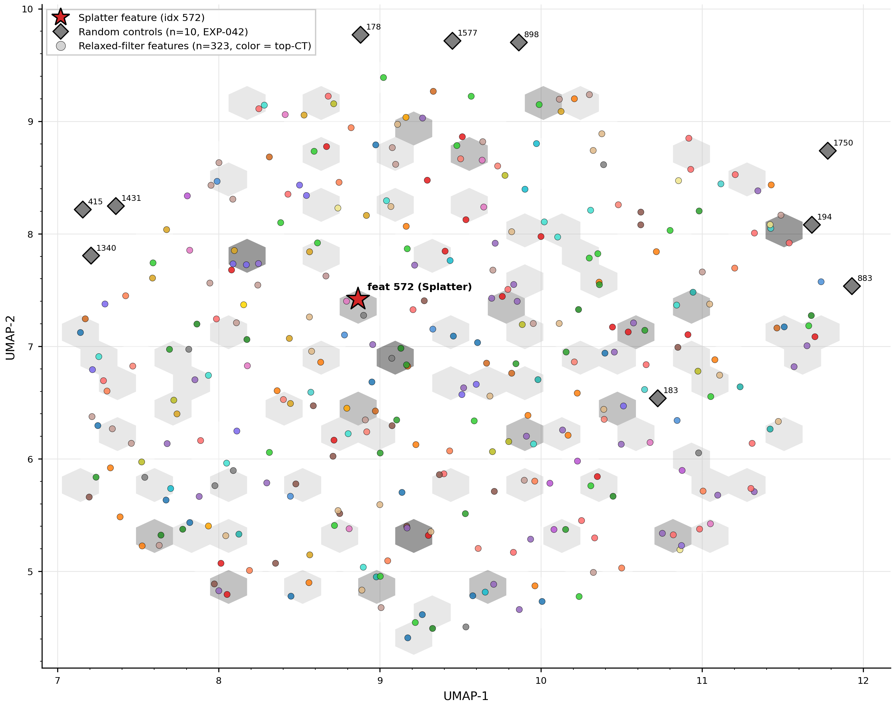
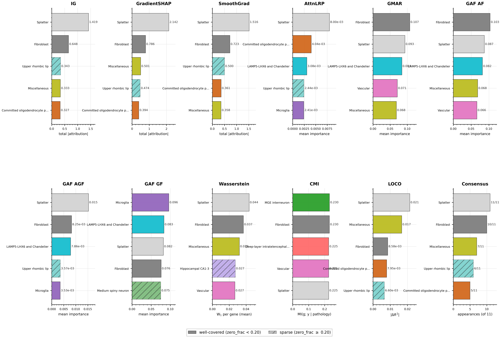

# ResDec-MHE

**Res**idual **Dec**omposition + **M**ulti-**H**ead **E**nsemble.

Hybrid graph-tabular model for predicting cognitive resilience from single-nucleus RNA-seq, with a multi-method interpretability suite.

## Overview

- **Task.** Continuous regression of `cogn_global` from per-subject snRNA-seq features, ROSMAP cohort, N=516.
- **Architecture.** Heterogeneous graph transformer + set transformer + fusion encoder, with a multi-head residual head over a frozen TabPFN-2.6 prediction. Composite output: `ŷ = ŷ_TabPFN + f_residual`.
- **Headline.** 5-fold mean R² = 0.4436 ± 0.0996 (per-fold std, ddof=1). Pooled R² = 0.4493.
- **Permutation null.** N=50 full-pipeline label-shuffle re-trains. z = 9.30, one-sided p = 0.0196 (= 1/51).

Manuscript in preparation.

## Results



Left: 5-fold cross-validation predictions vs actual `cogn_global`, all 516 subjects pooled. Color = per-subject residual. Right: 50 label-shuffled permutation-null R² values (small dots, KDE underlay) vs canonical R² = 0.4436 (large dot). Null mean = -0.32, std = 0.082.

### Baselines

One row per method family. R² is mean ± std across the same 5 folds. Full 22-baseline + 13-ablation table at [`tables/baseline_table.md`](tables/baseline_table.md) (also [`tables/baseline_table.csv`](tables/baseline_table.csv) for programmatic use).

| Model                         | R² (5-fold)        |
| ----------------------------- | ------------------ |
| **ResDec-MHE (this repo)**    | **0.4436 ± 0.10**  |
| TabPFN-2.6 standalone         | 0.3994 ± 0.10      |
| XGBoost (best classical)      | 0.3584 ± 0.05      |
| RandomForest                  | 0.3136 ± 0.07      |
| Ridge                         | 0.2697 ± 0.08      |
| Clinical-only linear regression | 0.2100 ± 0.08    |
| MixMIL (Engelmann '24)        | 0.1572 ± 0.08      |
| GPIO                          | 0.1529 ± 0.07      |
| Perceiver-IO                  | 0.1246 ± 0.05      |
| scPhase (Berson '25)          | -0.0742 ± 0.05     |

### Statistical tests

- **Stouffer-combined paired Wilcoxon vs TabPFN-2.6** across 5 seeds {21, 42, 67, 426, 2000}: combined z = 4.02, p = 2.93 × 10⁻⁵. Per-seed: 4/5 at p = 0.0312 (W = 15, 5/5 fold wins); seed 2000 at p = 0.0625 (W = 14, 4/5 wins, fold-0 Δ = -0.002). Source: [`seed_variation_wilcoxon.json`](outputs/canonical/interpretability/seed_variation_wilcoxon.json).
- **vs 22 baselines**: 22/22 pass BH-FDR at α = 0.05 (worst q = 0.014); 20/22 pass Bonferroni at α/22 = 0.00227. Source: [`baseline_fdr_correction.json`](outputs/canonical/interpretability/baseline_fdr_correction.json).
- **vs clinical-only baseline** (age, sex, education, Braak stage, APOE-ε4 dosage): ΔR² = +0.234 per-fold, 5/5 fold wins, paired Wilcoxon p = 0.03125. Source: [`clinical_baseline_summary.json`](outputs/canonical/clinical_baseline/clinical_baseline_summary.json).
- **Cross-seed stability**: 5 seeds yield mean R² = 0.4347 ± 0.0075, vs within-seed cross-fold std ≈ 0.10 — train/val split drives variance, not seed.

> **Caveat on validation.** All numbers are 5-fold cross-validation on N=516 ROSMAP subjects. No held-out 20% test set. External-cohort validation (SEA-AD, MAYO, MSBB) is the next step.

## Architecture

```
Per-subject input:
  ~70k cells × 31 cell types × 4785 highly variable genes
  Across 6 brain regions; per-CT cell counts span 4 orders of magnitude
  Cell-cell communication graph (CellChatDB-derived) per subject

         pseudobulk per (CT, gene)        cell-cell graph
                  │                              │
                  ▼                              ▼
         ┌──────────────────────────────────────────────┐
         │                Encoder                        │
         │  ├─ HGT graph transformer                     │
         │  ├─ Set transformer (cells per type)          │
         │  └─ Fusion → 64-d subject embedding z         │
         └──────────────────────────────────────────────┘
                              │
                              ▼
         ┌──────────────────────┐    ┌──────────────────────┐
         │  ResDec head         │    │ TabPFN-2.6 (frozen)  │
         │  8 parallel heads    │    │ per-CT gene-mean     │
         │  → f_residual        │    │ pseudobulk → ŷ_TabPFN│
         └──────────────────────┘    └──────────────────────┘
                     │                          │
                     └──────────┬───────────────┘
                                ▼
                       ŷ = ŷ_TabPFN + f_residual
```

Components:
- **TabPFN-2.6** (Hollmann et al. 2025): pretrained tabular foundation model, frozen, used as a baseline prediction. Inputs: per-cell-type gene-mean pseudobulk.
- **HGT** (Heterogeneous Graph Transformer): graph attention over the per-subject cell-cell communication graph (CellChatDB ligand-receptor pairs).
- **Set transformer** (Lee et al. 2019, ISAB variant): permutation-invariant pooling over cells within each cell type.
- **Fusion**: concatenate HGT and set-transformer outputs, project to a 64-dim subject embedding `z`.
- **ResDec head**: 8 parallel prediction heads (TabM-style multi-head expansion, k_tabm = 8) over `z`, with a vanilla 4-head multi-head attention block. Output is averaged into `f_residual`.

Ablations:

| Variant                                  | R² (5-fold)       |
| ---------------------------------------- | ----------------- |
| Canonical (this repo)                    | 0.4436 ± 0.10     |
| No TabPFN base (deep encoder only)       | 0.2659 ± 0.04     |
| FiLM with real subject metadata          | 0.4333 ± 0.08     |
| Diff-attention head (Ye et al. 2025)     | 0.4373 ± 0.09     |
| n_stages = 2                             | 0.4305 ± 0.09     |
| n_stages = 3                             | 0.4310 ± 0.09     |

The canonical configuration uses a FiLM layer with a zero metadata vector (effectively a no-op).

Lightning module: [`src/training/resdec_lightning_module.py`](src/training/resdec_lightning_module.py). Training driver: [`scripts/resdec_mhe/training/train.py`](scripts/resdec_mhe/training/train.py). Config: [`configs/resdec_mhe/canonical.yaml`](configs/resdec_mhe/canonical.yaml).

## Task framing



Each dot is one subject. Dashed line: OLS fit `cogn_global ~ gpath`. Color: per-subject residual (green = high cognition given pathology; magenta = low). Spearman ρ = -0.461 across 516 subjects.

- Training target is `cogn_global` (continuous z-scored cognition composite). The model is **not** trained on a pathology-residualized target.
- "Cognitive resilience" is interpreted post-hoc: subjects above the regression line have cognition higher than their pathology alone would predict.
- Cohort: ROSMAP, longitudinal study of brain aging at the Rush Alzheimer's Disease Center, gated via Synapse.

## Interpretability

Eleven methods grouped into three families. Outputs at [`outputs/canonical/interpretability/`](outputs/canonical/interpretability/).

| Family                                      | Methods                                                      |
| ------------------------------------------- | ------------------------------------------------------------ |
| Gradient-attribution (Captum)               | Integrated Gradients, GradientSHAP, SmoothGrad               |
| Attention-based                             | AttnLRP, GMAR, GAF AF / AGF / GF                             |
| Distributional / information / perturbation | Wasserstein-1, Conditional MI, LOCO zero-out                 |

<details>
<summary>Per-method one-line tooltips</summary>

| Method | Family | What it computes |
|---|---|---|
| Integrated Gradients (IG) | gradient | path integral of `∂output/∂input` from a baseline to the input |
| GradientSHAP | gradient | Shapley-value gradient attribution averaged over baselines |
| SmoothGrad | gradient | Gaussian-noise-averaged input gradient |
| AttnLRP | attention | layer-wise relevance propagation through attention layers |
| GMAR | attention | generic multi-head attention rollout |
| GAF AF / AGF / GF | attention | three variants of generic attention flow (Chefer et al. 2021) |
| Wasserstein-1 | distributional | per-(CT, gene) earth-mover distance, resilient n=129 vs vulnerable n=129 |
| Conditional MI | information | per-CT mutual information between pseudobulk and target, on raw N=516 |
| LOCO zero-out | perturbation | each CT's pseudobulk replaced with zero; measure ΔR² (5-fold inference) |

</details>

### Cross-method results — 12 panels, one per method


Each panel is a method's native visualization, not a unified bar chart:

- **Sunbursts** (Captum IG, GradientSHAP, SmoothGrad): inner ring = top cell types, outer ring = top genes per CT, area ∝ `mean_abs_attribution`. Splatter sector is largest in all three; Fibroblast second.
- **Radial violins / rainclouds** (AttnLRP, GMAR, GAF AF/AGF/GF): each spoke is a CT, the violin shows the per-subject (n=516) distribution of that method's attribution magnitude. AttnLRP top-1 = Splatter; GMAR/GAF AF top-1 = Fibroblast; GAF GF top-1 = Microglia. The five attention methods diverge below their top-2.
- **Ridge plot** (Wasserstein-1): top-5 (CT, gene) pairs by W₁ distance, each as a horizontal pair of overlaid resilient (n=129) vs vulnerable (n=129) pseudobulk distributions. Top-1 (CT, gene) is **Fibroblast × ST5** (W₁=0.322), not Splatter; Splatter × CTNNA2 is rank 2 (0.310).
- **Slope chart** (CMI): per-CT, unconditional MI → conditional MI given pathology (paired). Top-1 by conditional MI = MGE interneuron (0.230); Splatter is rank 5 (0.225). Negative deltas (pathology-conditioning increases MI) suggest pathology-orthogonal information.
- **Tornado / diverging bars** (LOCO ΔR² zero-out): both load-bearing (negative ΔR²) and adversarial (positive ΔR²) directions visible. Top load-bearing: Splatter (-0.0214); top adversarial: Cerebellar inhibitory (+0.0043).
- **Size-encoded consensus heatmap** (panel 12): each of the 31 CTs as a dot; color = top-5 frequency across the 11 methods, size = (1 − zero_frac) coverage status (sparse-coverage CTs visibly smaller).

Splatter is a [Siletti et al. 2023](https://www.science.org/doi/10.1126/science.add7046) reference cell type identified in our cohort by SST+CHODL+NPY+NOS1 markers. The two CTs reaching top-5 in nearly every method are Splatter (11/11) and Fibroblast (10/11; missing AttnLRP); below those, agreement decays. Upper rhombic lip appears top-5 in 7/11 methods but is sparsely covered (zero_frac=0.79) and is flagged as a likely gradient-from-zero artifact in our internal coverage-stratified analyses.

<details>
<summary>Alternative consensus visualizations</summary>

**Brain-anatomy spatial map** — CTs laid out by their approximate anatomical / lineage origin, color = top-5 frequency, size = coverage:



**Voronoi treemap** — true power-diagram (Aurenhammer 1987 algorithm; 116 iterations to <5% area error). Each CT is an organic region with area ∝ top-5 frequency, color = the same metric; sparse CTs are hatched:



</details>



Top: set-overlap of method top-5 cell-type rankings, 11 methods. Right-most bar (height 2) is the 11/11 intersection: Splatter and Fibroblast.

Bottom: set-overlap of top-50 (CT, gene) pair rankings, restricted to 6 gene-rankable methods (Captum IG, GradientSHAP, SmoothGrad, DE Wilcoxon, DE DESeq2, Wasserstein-1). Within-attribution-family overlaps reach 48/50; cross-family agreement drops to 0–8. 0 pairs in 6/6; 31 of 2332 union genes (collapsing the CT axis) appear in 6/6. Median pairwise Jaccard on (CT, gene) pairs = 0.0; on genes only = 0.16.

Source: [`outputs/canonical/interpretability/cross_method_gene_jaccard.json`](outputs/canonical/interpretability/cross_method_gene_jaccard.json).

### SAE causal patching



**Left panel:** 323 SAE features that pass the relaxed-interpretability filter (`non-dead AND mw_p_cognition < 0.05 AND fraction_active ∈ [10⁻⁴, 0.5] AND ct_dominance ≤ 0.7`), arranged on a circle. Each spoke is one feature; spoke length ∝ `ct_dominance`, color ∝ the feature's top cell type (`top_cell_types[0]`). Of these 323, exactly **one** has Splatter as its top cell type — feature 572 (highlighted with a red star). For comparison: 28 features have Microglia as top-CT, 23 OPC, 22 Deep-layer IT; Splatter is the lowest count of any of the 31 CTs.

**Right panel:** raincloud (KDE + strip + box) of patch ΔR² across the 5 cross-validation folds for 11 features: feature 572 (Splatter top-CT) on top, plus 10 randomly sampled control features below. Saturate-mode patch (clamp activation to its 99th-percentile cohort value) on feature 572: ΔR² = +0.000213 ± 0.000666 (5 folds). Random-feature null (10 × 5 = 50 saturate-mode patches): ΔR² = -0.0000728 ± 0.001190. The two distributions overlap.

Source: [`outputs/canonical/sae/feature_xref_consensus.json`](outputs/canonical/sae/feature_xref_consensus.json), [`outputs/canonical/interpretability/sae_causal_patching.json`](outputs/canonical/interpretability/sae_causal_patching.json), [`outputs/canonical/sae/batch_topk/fused/exp32_k64_seed0/feature_report.json`](outputs/canonical/sae/batch_topk/fused/exp32_k64_seed0/feature_report.json).

<details>
<summary>Alternative SAE visualizations</summary>

**Decoder-weight heatmap** — 11 patched features × 31 CTs, color = decoder weight (PiYG diverging, centered at 0). Loaded from the SAE state_dict (`W_dec` shape `[64, 2048]`); per-CT projection computed as `μ_c @ W_dec[:, j]` where `μ_c` is the per-CT mean encoder activation. Feature 572 (top row) shows broadly positive projection across many CTs with Splatter winning by a small margin (Splatter +1.72, Hippocampal CA1-3 +1.69, Oligodendrocyte +1.67) — consistent with its low ct_dominance (0.155 — polysemantic, not Splatter-axis):



**UMAP point cloud** — 2D UMAP of the 323 relaxed-filter features' 64-dim decoder vectors, with hexbin density backdrop. Splatter feature (red star) and 10 random control features (grey diamonds) highlighted:



</details>

<details>
<summary>Appendix β — unified bar-chart view of all 11 methods (for readers who want a clean ranked view)</summary>

A 12-panel grid (one per method, plus consensus) showing top-5 CTs as horizontal bars with method-specific units. Sparse CTs (zero_frac ≥ 0.20) are hatched. Same data as Fig 3 main, different visual encoding:



</details>

## Cognitive-residual variants

Beyond the canonical model trained on raw `cogn_global`, two variants train on **pathology-residualized cognition**, asking how much non-pathology-mediated cognitive signal the encoder captures.

- **Variant A (gpath-only):** target = `cogn_global − (α + β·gpath)`, fit per-fold on training subjects only.
- **Variant B (multi-axis):** target = `cogn_global − (α + β₁·gpath + β₂·tangsqrt + β₃·amylsqrt)`. Sensitivity check.

The **default residual base for both variants is a stacked TabPFN-2.6 + RandomForest average** (per-subject mean prediction; sigma = elementwise max). The stacked base improves the residual-base R² from TabPFN-only 0.181 → 0.219 (Variant A) and lifts the composite ResDec-MHE R² from 0.249 → 0.280 — a +0.031 paired Δ over TabPFN-only base, 4/5 fold wins, paired one-sided Wilcoxon p=0.094.

**Variant A composite R² across residual-base choices (5-fold mean ± std, best-checkpoint reinfer):**

| Residual base | Composite R² | Encoder marginal Δ (5/5 folds, p=0.031) |
|---|---:|---:|
| **Stacked TabPFN+RF (default)** | **0.280 ± 0.066** | +0.061 over base (p=0.031) |
| TabPFN-only | 0.249 ± 0.095 | +0.068 over base (p=0.031) |
| RandomForest only | 0.239 ± 0.041 | +0.042 over base (p=0.031) |

| Model on residualized target | Variant A R² (5-fold) | Variant B R² (5-fold) |
|---|---|---|
| **ResDec-MHE w/ stacked base (this repo)** | **0.280 ± 0.066** | 0.184 ± 0.073 |
| ResDec-MHE w/ TabPFN-only base | 0.249 ± 0.095 | 0.168 ± 0.083 |
| RandomForest               | 0.197 ± 0.034 | 0.149 ± 0.072 |
| TabPFN-2.6 standalone       | 0.181 ± 0.090 | 0.157 ± 0.090 |
| SVR (RBF)                   | 0.157 ± 0.040 | 0.129 ± 0.038 |
| XGBoost (CPU)               | 0.138 ± 0.050 | 0.053 ± 0.102 |
| Clinical-only (APOE+age+sex+ed+Braak) | 0.020 ± 0.041 | 0.007 ± 0.044 |
| ElasticNet                  | -0.003 | -0.002 |
| Ridge                       | -0.164 ± 0.108 | -0.168 ± 0.152 |

For Variant A: stacked-base ResDec-MHE wins the panel by +0.083 over the strongest classical baseline (RandomForest) and +0.099 over TabPFN. The clinical-only baseline at R²≈0.02 confirms residualization is clean — most clinical signal is via pathology and the residual target retains negligible clinical predictivity. The "swap residual base" choice is exposed via the variant config's `data.tabpfn_oof_dir` / `tabpfn_outer_dir` fields; see `configs/resdec_mhe/cogn_residual/{gpath_only,gpath_only_tabpfn_base,gpath_only_rf_base,multi_axis,multi_axis_tabpfn_base}.yaml`.

**Variant A permutation null** (N=20 full-pipeline label-shuffle re-trains, stacked base):
- z = +9.79 null-std units, one-sided empirical p = 0.048 (= 1/21 floor at N=20)
- null mean = −0.2427 ± 0.0534
- 0/20 null permutations ≥ canonical R²=+0.280
- TabPFN-only base perm null (preserved for comparison): z = +6.64

**Cross-variant differential analyses (stacked base):**
- DAE (per CT-gene attribution magnitude paired Wilcoxon): 0/148335 pairs significant at BH-FDR for Captum IG / GradientSHAP / SmoothGrad → variant doesn't redirect per-pair attribution.
- DCR (per-method CT-rank Spearman): ρ = 0.65-0.96 for 7/8 attribution methods → CT importance ranking preserved. Captum IG ρ=0.88, GAF AF ρ=0.96, GMAR ρ=0.95. One outlier: gradient-free GAF at ρ=-0.07 (mildly improved from -0.20 under TabPFN-only; method-noise rather than biology). Multi-axis Captum IG ρ=0.78.
- DCCI (CT-CT edge attention paired Wilcoxon): 0/961 edges significant → CCC structure preserved.

**Within-variant binned subgroup** (top vs bottom quartile residualized target; stacked-base attribution for variants):
- DGE Wilcoxon: canonical 4154/148335 sig pairs; Variant A 1239 (≈30 % of canonical); Variant B 261 (≈6 %). Monotonic decrease as residualization removes more variance.
- DGE DESeq2: 0/148335 sig in all 3 variants. Cross-method disagreement vs Wilcoxon at this N (~258) is dramatic — the deep model captures distributional signal classical DGE cannot recover.
- Per-CT Captum importance: 0/31 CTs significant in canonical or Variant B; **1/31 in Variant A: Deep-layer corticothalamic and 6b (padj=0.033)** — the same CT that hosts PDE10A/ADAMTSL1/NRXN3/ERBB4 in the gene-level resilience module. Attribution-level convergence with gene-level finding.
- Differential CCC: 0/961 edges significant in canonical / Variant A.

Interpretation: residualizing cognition against pathology retains substantial predictive signal that ResDec-MHE captures better than any tested baseline; the model attends to the same per-(CT, gene) features regardless of which scalar cognitive component is the target. Cognitive resilience is a fine-grained gene-by-cell-type phenotype, not a coarse-grained CT-level rewiring.

Full per-variant artifacts under `outputs/canonical/cogn_residual/{gpath_only,multi_axis}/`. Plan + execution doc: `docs/plans/2026-05-03-cogn-residual-variant-design.md`.

## Reproducibility

ROSMAP cohort data is gated. Place the inputs at:
- `data/snRNAseq/adata_ROSMAP_preprocessed.h5ad` (≈70 GB; 516 subjects × 31 CTs × 4785 HVGs)
- `data/precomputed/precomputed_dataset.pt` (per-subject pseudobulk + cell metadata cache)
- `data/canonical/tabpfn_outer_fold{0..4}.npz`, `tabpfn_oof_fold{0..4}.npz` (per-fold TabPFN caches)
- `outputs/splits.json` (canonical 5-fold split assignments)
- `data/metadata_ROSMAP/metadata.csv` (clinical metadata)

Tests:
```bash
uv run pytest tests/unit/         # per-module
uv run pytest tests/integration/  # end-to-end
uv run pytest tests/              # full suite, ~6 min
```

End-to-end pipeline:

```bash
# 1. Build TabPFN caches
uv run python scripts/resdec_mhe/tabpfn/compute_top_k_features.py
uv run python scripts/resdec_mhe/tabpfn/compute_oof.py
uv run python scripts/resdec_mhe/tabpfn/compute_outer.py

# 2. Train ResDec-MHE 5-fold (parallel across 2 GPUs)
CONFIG=configs/resdec_mhe/canonical.yaml \
OUTROOT=outputs/canonical/p5_canonical_seed42 \
SEED=42 \
bash scripts/resdec_mhe/training/run_5fold_parallel.sh

# 3. Aggregate the paper baseline table
uv run python scripts/resdec_mhe/interpretability/make_baseline_table.py

# 4. Headline interpretability suite
uv run python scripts/resdec_mhe/interpretability/captum_composite_attribution.py
uv run python scripts/resdec_mhe/interpretability/run_distributional_resilience.py
uv run python scripts/resdec_mhe/interpretability/run_loco_zero_out.py
uv run python scripts/resdec_mhe/interpretability/run_resilience_analyses.py --aggregation raw_max

# 5. SAE distributed-representation suite
uv run python scripts/resdec_mhe/interpretability/extract_sae_activations.py
CUDA_VISIBLE_DEVICES=0 GPU_INDEX=0 NUM_GPUS=2 bash scripts/resdec_mhe/run_sae_sweep.sh &
CUDA_VISIBLE_DEVICES=1 GPU_INDEX=1 NUM_GPUS=2 bash scripts/resdec_mhe/run_sae_sweep.sh &
wait
uv run python scripts/resdec_mhe/interpretability/run_sae_causal_patching.py

# 6. Permutation null (N=50, full-pipeline; ~16 hr in tmux)
tmux new -d -s permnull_n50 'bash scripts/resdec_mhe/_launch_permnull_n50_perm_shard.sh'
uv run python scripts/resdec_mhe/training/aggregate_permnull_n50_shards.py

# Render the README's figures (10 PNG outputs in figures/)
uv run python scripts/resdec_mhe/interpretability/make_readme_fig1_problem.py
uv run python scripts/resdec_mhe/interpretability/make_readme_fig2_result.py
uv run python scripts/resdec_mhe/interpretability/make_readme_fig3_methods_grid.py
uv run python scripts/resdec_mhe/interpretability/make_readme_fig3alt_brain_anatomy.py
uv run python scripts/resdec_mhe/interpretability/make_readme_fig3alt_voronoi.py
uv run python scripts/resdec_mhe/interpretability/make_readme_fig4_upset.py
uv run python scripts/resdec_mhe/interpretability/make_readme_fig5_sae_main.py
uv run python scripts/resdec_mhe/interpretability/make_readme_fig5alt_decoder_heatmap.py
uv run python scripts/resdec_mhe/interpretability/make_readme_fig5alt_umap.py
uv run python scripts/resdec_mhe/interpretability/make_readme_figbeta_bars.py
```

## Repository structure

### Top-level

```
proj_ml_snrna/
├── src/             # Production source (importable as src.*)
├── scripts/         # CLI entrypoints + orchestration
├── configs/         # OmegaConf YAMLs
├── tests/           # pytest tree
├── baselines/       # Vendored or adapted external baselines
├── tables/          # Tracked baseline + ablation tables (.md, .csv)
├── figures/         # Tracked README figures (PNG)
├── tools/           # Standalone tooling (test runners, sweeps)
├── docs/            # Local-only knowledge base + plans (gitignored)
├── data/            # Raw + precomputed inputs (gitignored)
├── outputs/         # Training + interpretability outputs (gitignored)
├── pytest.ini       # Pytest config (markers, ignore patterns)
├── README.md        # This file
└── LICENSE          # GPL-3.0
```

### `src/` — production code

```
src/
├── analysis/                  # Post-hoc analyses
│   ├── attribution/           # Captum IG, GradientSHAP, SmoothGrad
│   ├── attention/             # AttnLRP, GMAR, GAF AF/AGF/GF
│   ├── distributional/        # Wasserstein-1, pseudobulk distributional shifts
│   ├── information_theory/    # Conditional MI, raw-pseudobulk
│   ├── perturbation/          # LOCO zero-out, counterfactuals (Wachter Mode-A)
│   ├── sae/                   # Sparse autoencoders: TopK, BatchTopK, training, inference
│   ├── ccc/                   # Cell-cell-communication graph analyses
│   └── statistical/           # Wilcoxon, Stouffer, BH-FDR, bootstrap CI
├── data/                      # Data IO and pipeline
│   ├── adata_loader.py        # AnnData → per-subject pseudobulk + cell metadata
│   ├── precomputed_dataset.py # Cached PrecomputedDataset (.pt files)
│   ├── datamodule.py          # PyTorch Lightning DataModule
│   ├── feature_loaders.py     # Targets and metadata utilities
│   ├── splits.py              # Stratified K-fold split logic
│   └── constants.py           # CT names, region IDs, edge type IDs
├── models/                    # Encoder + heads
│   ├── full_model.py          # CognitiveResilienceModel (encoder)
│   ├── hgt/                   # Heterogeneous Graph Transformer
│   ├── set_transformer/       # ISAB-based set transformer over cells per CT
│   ├── fusion/                # Cross-attention fusion of HGT + set-transformer
│   ├── pathology_attention/   # Pathology-stratified attention pooling
│   └── resdec_head/           # ResDecMHEHead (canonical head)
│       ├── film.py            # FiLM conditioning layer
│       ├── tabm.py            # TabM-style multi-head expansion
│       ├── attention.py       # Vanilla MHA + diff-attention variant
│       └── hyperconn.py       # HyperConn residual link
├── training/                  # Lightning training
│   ├── resdec_lightning_module.py  # The LightningModule
│   ├── callbacks/                  # Custom Lightning callbacks
│   └── optimizers/                 # OptimizerFactory + LR schedulers
├── inference/                 # Inference pipelines
├── visualization/             # Figure-drawing primitives
│   ├── theme.py               # Project visual standard (palettes, fonts, save_fig)
│   ├── prediction_plots.py    # Predicted vs actual, per-fold scatters
│   ├── attribution_plots.py   # Captum / SAE attribution figures
│   ├── attention_plots.py     # Attention rollout, per-CT magnitudes
│   ├── distributional_plots.py # Wasserstein, density overlays
│   ├── architecture_plots.py  # Architecture diagrams
│   └── ...                    # Additional per-analysis modules
└── utils/                     # Shared utilities (io, gene names, cell types, reproducibility)
```

### `scripts/resdec_mhe/` — CLI entrypoints + orchestration

```
scripts/resdec_mhe/
├── training/
│   ├── train.py                              # Main training driver
│   ├── run_5fold_parallel.sh                 # Train 5 folds across 2 GPUs
│   ├── run_seed_variation.sh                 # Train across 5 seeds for variance estimate
│   ├── run_permutation_test.py               # Full-pipeline label-shuffle null
│   ├── run_permutation_test_inference_only.py # Strategy-A perm null (~1 sec/perm)
│   ├── aggregate_permnull_n50_shards.py      # Aggregate sharded perm-null shards
│   └── _launch_permnull_n50_perm_shard.sh    # tmux launcher for sharded perm null
├── tabpfn/
│   ├── compute_top_k_features.py             # Build top-K HVG selection for TabPFN
│   ├── compute_oof.py                        # Inner-OOF predictions (training residual base)
│   └── compute_outer.py                      # Outer-fold predictions (val residual base)
├── interpretability/        # ~100 scripts: SAE, Captum, CMI, Wasserstein, figures
│   ├── captum_composite_attribution.py       # Captum IG over the canonical model
│   ├── extract_sae_activations.py            # Pull encoder activations for SAE training
│   ├── run_sae_sweep.sh                      # 60-config SAE sweep
│   ├── run_sae_causal_patching.py            # SAE feature causal-patching experiment
│   ├── run_distributional_resilience.py      # Pseudobulk Wasserstein-1
│   ├── run_loco_zero_out.py                  # LOCO ΔR² ablation
│   ├── run_resilience_analyses.py            # Conditional MI on raw pseudobulk
│   ├── make_baseline_table.py                # Aggregate canonical + 22 baselines
│   ├── make_readme_fig{1,2,3,4,5}_*.py       # README figure orchestrators
│   └── ...                                   # ~80 additional analysis + figure scripts
├── eval/                                     # Evaluation utilities
└── batch_runners/                            # Sweep runners
```

### `configs/` — OmegaConf YAMLs

```
configs/
├── default.yaml                              # Base configuration (anonymized example paths)
├── resdec_mhe/
│   ├── canonical.yaml                        # Canonical reproduction config (the actual one)
│   ├── example_config.yaml                   # Anonymized template — copy + edit
│   ├── ablations/                            # Per-ablation YAMLs (no-tabpfn, no-film, ...)
│   ├── diff_test_no_reg_with_flag.yaml       # DiffAttn variant config
│   └── entropy_reg.yaml                      # Entropy-regularization variant
├── ablations/                                # Cross-cutting ablation configs
├── archived/                                 # Pre-canonical configs (kept for diff/history)
├── hpo_round6.yaml, hpo_round7.yaml          # Optuna HPO sweep configs
└── MapMyCells/                               # MapMyCells alignment configs
```

### `tests/` — pytest tree

```
tests/
├── unit/                # Per-module unit tests (~1500 tests, ~6 min full sweep)
│   ├── analysis/        # SAE, Captum, CMI, Wasserstein
│   ├── data/            # Datasets, datamodule, splits, loaders
│   ├── models/          # Encoder + heads
│   ├── training/        # Lightning module, optimizers, schedulers
│   ├── visualization/   # Figure-drawing primitives
│   ├── interpretability/# Interp orchestrator helper tests
│   └── archive/         # Pre-canonical legacy tests (excluded by pytest.ini)
├── integration/         # End-to-end pipeline smoke tests
├── regression/          # Numerical regression checks
├── smoke/               # Fast sanity checks
└── negative/            # Negative-controls (intentional failures)
```

### `baselines/` — vendored or adapted external baselines

```
baselines/
├── mixmil/                # MixMIL (Engelmann et al. 2024) — adapted for the 516-split
├── scPhase/               # scPhase (Berson et al. 2025) — adapted
├── gpio/                  # GPIO baseline
├── cloudpred/             # CloudPred (Daum et al. 2024)
├── perceiver_io/          # Perceiver-IO baseline
├── set_transformer/       # Set-transformer-only baseline
└── abmil/                 # Attention-MIL baseline
```

### `outputs/` (gitignored) — training + interpretability artifacts

```
outputs/
├── canonical/                                  # Canonical run artifacts
│   ├── p5_canonical_seed42/                    # 5-fold canonical training output
│   ├── p5_ablation_*/                          # Ablation training outputs
│   ├── permutation_test_n50_full/              # N=50 permutation null shards + summary
│   ├── clinical_baseline/                      # Clinical-only LinReg + ElasticNet
│   ├── interpretability/                       # All post-hoc analyses
│   │   ├── captum_ig/                          # Captum IG attribution outputs
│   │   ├── captum_robustness/                  # GradientSHAP + SmoothGrad
│   │   ├── attention_attribution/              # AttnLRP / GMAR / GAF outputs
│   │   ├── distributional_resilience/          # Wasserstein-1 pseudobulk
│   │   ├── conditional_mi_*.json               # CMI variants (raw_max, raw_vector)
│   │   ├── loco_zero_out/                      # LOCO ΔR² per CT
│   │   ├── counterfactuals_{relative,absolute}/# Wachter counterfactuals
│   │   ├── ccc/, ccc_heterogeneity/            # Cell-cell-communication analyses
│   │   ├── seed_variation_wilcoxon.json        # Cross-seed Wilcoxon + Stouffer
│   │   ├── baseline_fdr_correction.json        # BH-FDR + Bonferroni vs 22 baselines
│   │   ├── paper_baseline_table.{md,csv}       # Full 22-baseline + 13-ablation table
│   │   └── ...                                 # ~60 additional analysis JSONs
│   └── sae/                                    # Sparse autoencoder sweep + causal patching
│       ├── batch_topk/, topk/                  # Per-architecture sweeps
│       ├── feature_xref_consensus.json         # Consensus across SAE configs
│       ├── stability_smaller_m/                # 180-config smaller-m sweep
│       └── cross_seed_stability/               # Cross-seed feature stability
└── splits.json                                 # Canonical 5-fold split assignments
```

### `data/` (gitignored) — inputs

```
data/
├── snRNAseq/             # Preprocessed AnnData (h5ad)
├── precomputed/          # Per-subject pseudobulk + cell metadata cache (R*.pt files)
├── canonical/            # Per-fold TabPFN OOF + outer caches (tabpfn_*.npz)
├── metadata_ROSMAP/      # Clinical metadata CSV
├── database/             # CellChatDB ligand-receptor pairs
└── liana_cache/          # LIANA-derived cell-cell communication graphs
```

## Citation

```
Hong, J.H. (2026). ResDec-MHE: Hybrid Graph-Tabular Model for Cognitive
Resilience Prediction with Multi-Method Interpretability. GitHub:
https://github.com/Joon-Hwan-Hong/multi-scale-hybrid-hgt
```

## License

GPL-3.0. See [LICENSE](LICENSE).

## Acknowledgments

PyTorch, PyTorch Lightning, Pyro, OmegaConf, scanpy, anndata, statsmodels, Captum. Baselines: TabPFN-2.6 (Hollmann et al. 2025), XGBoost, MixMIL (Engelmann et al. 2024), scPhase (Berson et al. 2025), GPIO, CloudPred, Perceiver-IO. SAE methodology: Cunningham et al. 2024, Bussmann 2024, Gao 2024, Paulo & Belrose 2025, Heap et al. 2026. ROSMAP cohort: Religious Orders Study and Memory and Aging Project, Rush Alzheimer's Disease Center.
